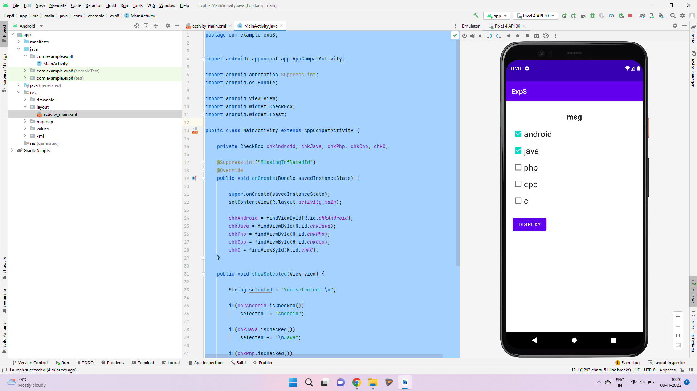
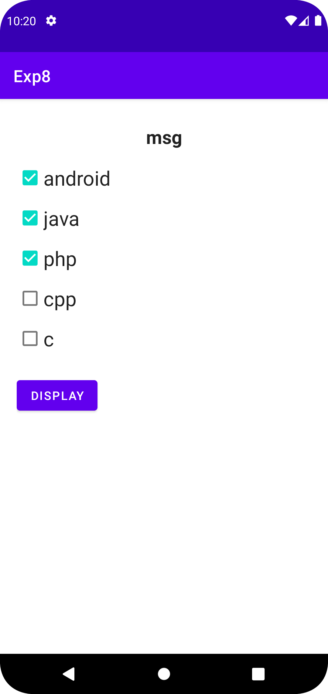
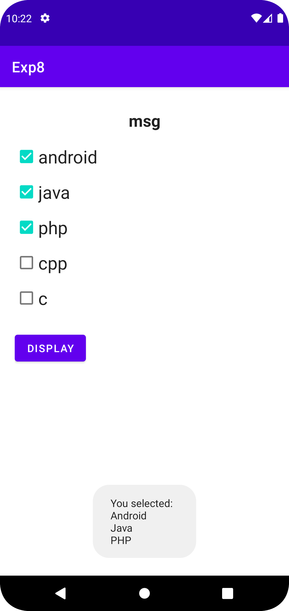

# Ex.No:8 Build a program to show five checkboxes and toast selected checkboxes.


## AIM:

To create a list using checkbox to display selected checkbox item using Android Studio.

## EQUIPMENTS REQUIRED:

Android Studio(Min.required Artic Fox)

## ALGORITHM:
1. Open Android Studio and then click on File -> New -> New project.

2. Then type the Application name as "listofitemselect" and click Next.

3. Then select the Minimum SDK as shown below and click Next.

4. Then select the Empty Activity and click Next. Finally click Finish.

5. Design layout using UI components in activity_main.xml.

6. Display the list using checkbox in MainActivity file.

7. Save and run the application.


## PROGRAM:
```
/*
Program to display check list item”.
Developed by:Manoj Choudhary V
Registeration Number :212221240025
*/
```
### MainActivity.java
```
package com.example.exp8;


import androidx.appcompat.app.AppCompatActivity;

import android.annotation.SuppressLint;
import android.os.Bundle;

import android.view.View;
import android.widget.CheckBox;
import android.widget.Toast;

public class MainActivity extends AppCompatActivity {

    private CheckBox chkAndroid, chkJava, chkPhp, chkCpp, chkC;

    @SuppressLint("MissingInflatedId")
    @Override
    public void onCreate(Bundle savedInstanceState) {

        super.onCreate(savedInstanceState);
        setContentView(R.layout.activity_main);

        chkAndroid = findViewById(R.id.chkAndroid);
        chkJava = findViewById(R.id.chkJava);
        chkPhp = findViewById(R.id.chkPhp);
        chkCpp = findViewById(R.id.chkCpp);
        chkC = findViewById(R.id.chkC);
    }

    public void showSelected(View view) {

        String selected = "You selected: \n";

        if(chkAndroid.isChecked())
            selected += "Android";

        if(chkJava.isChecked())
            selected += "\nJava";

        if(chkPhp.isChecked())
            selected += "\nPHP";

        if(chkCpp.isChecked())
            selected += "\nCPP";

        if(chkC.isChecked())
            selected += "\nC";

        Toast.makeText(MainActivity.this, selected, Toast.LENGTH_SHORT).show();
    }
}
```
### Activity_Main.xml
```
<?xml version="1.0" encoding="utf-8"?>
<LinearLayout xmlns:android="http://schemas.android.com/apk/res/android"
    android:layout_width="fill_parent"
    android:layout_height="fill_parent"
    android:orientation="vertical"
    android:padding="20dp">

    <TextView
        android:layout_width="match_parent"
        android:layout_height="wrap_content"
        android:gravity="center"
        android:text="msg"
        style="@style/TextAppearance.AppCompat.Large"
        android:layout_margin="10dp"
        android:textStyle="bold"/>

    <CheckBox
        android:id="@+id/chkAndroid"
        android:layout_width="wrap_content"
        android:layout_height="wrap_content"
        android:text="android"
        style="@style/TextAppearance.AppCompat.Headline"/>

    <CheckBox
        android:id="@+id/chkJava"
        android:layout_width="wrap_content"
        android:layout_height="wrap_content"
        android:text="java"
        style="@style/TextAppearance.AppCompat.Headline"/>

    <CheckBox
        android:id="@+id/chkPhp"
        android:layout_width="wrap_content"
        android:layout_height="wrap_content"
        android:text="php"
        style="@style/TextAppearance.AppCompat.Headline"/>

    <CheckBox
        android:id="@+id/chkCpp"
        android:layout_width="wrap_content"
        android:layout_height="wrap_content"
        android:text="cpp"
        style="@style/TextAppearance.AppCompat.Headline"/>

    <CheckBox
        android:id="@+id/chkC"
        android:layout_width="wrap_content"
        android:layout_height="wrap_content"
        android:text="c"
        style="@style/TextAppearance.AppCompat.Headline"/>

    <Button android:id="@+id/btnDisplay"
        android:layout_width="wrap_content"
        android:layout_height="wrap_content"
        android:text="Display"
        android:layout_marginTop="20dp"
        android:onClick="showSelected"/>

</LinearLayout>
```


## OUTPUT






## RESULT
Thus a Simple Android Application create a list using checkbox to display selected checkbox using Android Studio is developed and executed successfully.
