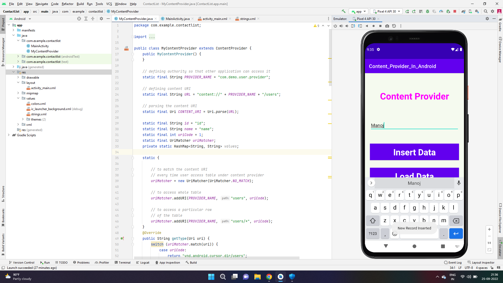
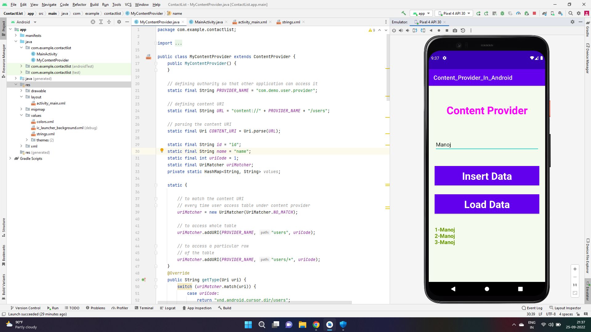
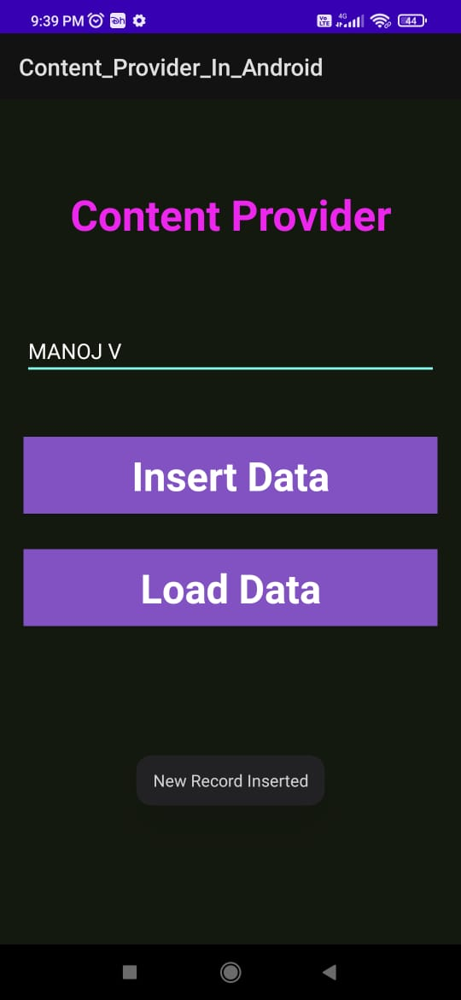
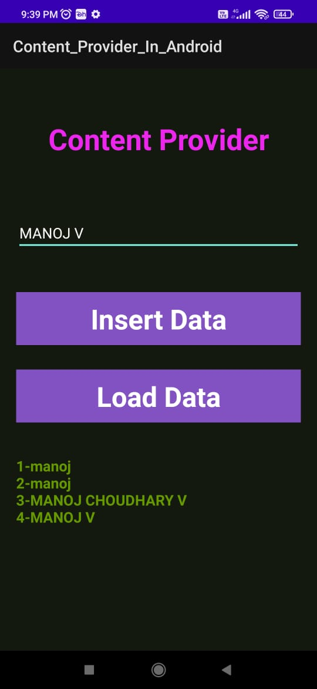

# Ex.No:3 Create Your Own Content Providers to get Contacts details.


## AIM:

To create your own content providers to get contacts details using Android Studio.

## EQUIPMENTS REQUIRED:

Android Studio(Min. required Artic Fox)

## ALGORITHM:

Step 1: Open Android Stdio and then click on File -> New -> New project.

Step 2: Then type the Application name as “ex.no.3″ and click Next. 

Step 3: Then select the Minimum SDK as shown below and click Next.

Step 4: Then select the Empty Activity and click Next. Finally click Finish.

Step 5: Design layout in activity_main.xml.

Step 6: Get contacts details and Display details give in MainActivity file.

Step 7: Save and run the application.

## PROGRAM:
```
/*
Program to print the text create your own content providers to get contacts details.
Developed by:MANOJ CHOUDHARY V
Registeration Number :212221240025
*/
```
## MainActivity.java
```
package com.example.contactlist;

import androidx.appcompat.app.AppCompatActivity;

import android.content.ContentValues;
import android.content.Context;
import android.database.Cursor;
import android.net.Uri;
import android.os.Bundle;
import android.view.MotionEvent;
import android.view.View;
import android.view.inputmethod.InputMethodManager;
import android.widget.EditText;
import android.widget.TextView;
import android.widget.Toast;

public class MainActivity extends AppCompatActivity {

    @Override
    protected void onCreate(Bundle savedInstanceState) {
        super.onCreate(savedInstanceState);
        setContentView(R.layout.activity_main);
    }

    @Override
    public boolean onTouchEvent(MotionEvent event) {
        InputMethodManager imm = (InputMethodManager)getSystemService(Context.INPUT_METHOD_SERVICE);
        imm.hideSoftInputFromWindow(getCurrentFocus().getWindowToken(), 0);
        return true;
    }
    public void onClickAddDetails(View view) {

        // class to add values in the database
        ContentValues values = new ContentValues();

        // fetching text from user
        values.put(MyContentProvider.name, ((EditText) findViewById(R.id.textName)).getText().toString());

        // inserting into database through content URI
        getContentResolver().insert(MyContentProvider.CONTENT_URI, values);

        // displaying a toast message
        Toast.makeText(getBaseContext(), "New Record Inserted", Toast.LENGTH_LONG).show();
    }

    public void onClickShowDetails(View view) {
        // inserting complete table details in this text field
        TextView resultView= (TextView) findViewById(R.id.res);

        // creating a cursor object of the
        // content URI
        Cursor cursor = getContentResolver().query(Uri.parse("content://com.demo.user.provider/users"), null, null, null, null);

        // iteration of the cursor
        // to print whole table
        if(cursor.moveToFirst()) {
            StringBuilder strBuild=new StringBuilder();
            while (!cursor.isAfterLast()) {
                strBuild.append("\n"+cursor.getString(cursor.getColumnIndex("id"))+ "-"+ cursor.getString(cursor.getColumnIndex("name")));
                cursor.moveToNext();
            }
            resultView.setText(strBuild);
        }
        else {
            resultView.setText("No Records Found");
        }
    }
}
```
## MyContentprovider.java
```
package com.example.contactlist;

import android.content.ContentProvider;
import android.content.ContentUris;
import android.content.ContentValues;
import android.content.Context;
import android.content.UriMatcher;
import android.database.Cursor;
import android.database.sqlite.SQLiteDatabase;
import android.database.sqlite.SQLiteException;
import android.database.sqlite.SQLiteOpenHelper;
import android.database.sqlite.SQLiteQueryBuilder;
import android.net.Uri;
import java.util.HashMap;

public class MyContentProvider extends ContentProvider {
    public MyContentProvider() {
    }

    // defining authority so that other application can access it
    static final String PROVIDER_NAME = "com.demo.user.provider";

    // defining content URI
    static final String URL = "content://" + PROVIDER_NAME + "/users";

    // parsing the content URI
    static final Uri CONTENT_URI = Uri.parse(URL);

    static final String id = "id";
    static final String name = "name";
    static final int uriCode = 1;
    static final UriMatcher uriMatcher;
    private static HashMap<String, String> values;

    static {

        // to match the content URI
        // every time user access table under content provider
        uriMatcher = new UriMatcher(UriMatcher.NO_MATCH);

        // to access whole table
        uriMatcher.addURI(PROVIDER_NAME, "users", uriCode);

        // to access a particular row
        // of the table
        uriMatcher.addURI(PROVIDER_NAME, "users/*", uriCode);
    }
    @Override
    public String getType(Uri uri) {
        switch (uriMatcher.match(uri)) {
            case uriCode:
                return "vnd.android.cursor.dir/users";
            default:
                throw new IllegalArgumentException("Unsupported URI: " + uri);
        }
    }
    // creating the database
    @Override
    public boolean onCreate() {
        Context context = getContext();
        DatabaseHelper dbHelper = new DatabaseHelper(context);
        db = dbHelper.getWritableDatabase();
        if (db != null) {
            return true;
        }
        return false;
    }
    @Override
    public Cursor query(Uri uri, String[] projection, String selection,
                        String[] selectionArgs, String sortOrder) {
        SQLiteQueryBuilder qb = new SQLiteQueryBuilder();
        qb.setTables(TABLE_NAME);
        switch (uriMatcher.match(uri)) {
            case uriCode:
                qb.setProjectionMap(values);
                break;
            default:
                throw new IllegalArgumentException("Unknown URI " + uri);
        }
        if (sortOrder == null || sortOrder == "") {
            sortOrder = id;
        }
        Cursor c = qb.query(db, projection, selection, selectionArgs, null,
                null, sortOrder);
        c.setNotificationUri(getContext().getContentResolver(), uri);
        return c;
    }

    // adding data to the database
    @Override
    public Uri insert(Uri uri, ContentValues values) {
        long rowID = db.insert(TABLE_NAME, "", values);
        if (rowID > 0) {
            Uri _uri = ContentUris.withAppendedId(CONTENT_URI, rowID);
            getContext().getContentResolver().notifyChange(_uri, null);
            return _uri;
        }
        throw new SQLiteException("Failed to add a record into " + uri);
    }

    @Override
    public int update(Uri uri, ContentValues values, String selection,
                      String[] selectionArgs) {
        int count = 0;
        switch (uriMatcher.match(uri)) {
            case uriCode:
                count = db.update(TABLE_NAME, values, selection, selectionArgs);
                break;
            default:
                throw new IllegalArgumentException("Unknown URI " + uri);
        }
        getContext().getContentResolver().notifyChange(uri, null);
        return count;
    }

    @Override
    public int delete(Uri uri, String selection, String[] selectionArgs) {
        int count = 0;
        switch (uriMatcher.match(uri)) {
            case uriCode:
                count = db.delete(TABLE_NAME, selection, selectionArgs);
                break;
            default:
                throw new IllegalArgumentException("Unknown URI " + uri);
        }
        getContext().getContentResolver().notifyChange(uri, null);
        return count;
    }

    // creating object of database
    // to perform query
    private SQLiteDatabase db;

    // declaring name of the database
    static final String DATABASE_NAME = "UserDB";

    // declaring table name of the database
    static final String TABLE_NAME = "Users";

    // declaring version of the database
    static final int DATABASE_VERSION = 1;

    // sql query to create the table
    static final String CREATE_DB_TABLE = " CREATE TABLE " + TABLE_NAME
            + " (id INTEGER PRIMARY KEY AUTOINCREMENT, "
            + " name TEXT NOT NULL);";

    // creating a database
    private static class DatabaseHelper extends SQLiteOpenHelper {

        // defining a constructor
        DatabaseHelper(Context context) {
            super(context, DATABASE_NAME, null, DATABASE_VERSION);
        }

        // creating a table in the database
        @Override
        public void onCreate(SQLiteDatabase db) {

            db.execSQL(CREATE_DB_TABLE);
        }

        @Override
        public void onUpgrade(SQLiteDatabase db, int oldVersion, int newVersion) {

            // sql query to drop a table
            // having similar name
            db.execSQL("DROP TABLE IF EXISTS " + TABLE_NAME);
            onCreate(db);
        }
    }
}
```
## Activitymain.xml
```
<?xml version="1.0" encoding="utf-8"?>
<androidx.constraintlayout.widget.ConstraintLayout
    xmlns:android="http://schemas.android.com/apk/res/android"
    xmlns:app="http://schemas.android.com/apk/res-auto"
    xmlns:tools="http://schemas.android.com/tools"
    android:layout_width="match_parent"
    android:layout_height="match_parent"
    android:background="#168BC34A"
    tools:context=".MainActivity">

    <LinearLayout
        android:id="@+id/linearLayout"
        android:layout_width="match_parent"
        android:layout_height="wrap_content"
        android:layout_centerVertical="true"
        android:orientation="vertical"
        app:layout_constraintBottom_toTopOf="@+id/imageView"
        app:layout_constraintEnd_toEndOf="parent"
        app:layout_constraintStart_toStartOf="parent"
        app:layout_constraintTop_toTopOf="parent"
        app:layout_constraintVertical_bias="0.13"
        tools:ignore="MissingConstraints">

        <TextView
            android:id="@+id/textView1"
            android:layout_width="match_parent"
            android:layout_height="wrap_content"
            android:layout_marginTop="40dp"
            android:layout_marginBottom="70dp"
            android:text="@string/heading"
            android:textAlignment="center"
            android:textAppearance="@style/TextAppearance.AppCompat.Large"
            android:textColor="#FF00FF"
            android:textSize="36sp"
            android:textStyle="bold" />

        <EditText
            android:id="@+id/textName"
            android:layout_width="match_parent"
            android:layout_height="wrap_content"
            android:layout_marginStart="20dp"
            android:layout_marginEnd="20dp"
            android:layout_marginBottom="40dp"
            android:hint="@string/hintText" />

        <Button
            android:id="@+id/insertButton"
            android:layout_width="match_parent"
            android:layout_height="match_parent"
            android:layout_marginStart="20dp"
            android:layout_marginTop="10dp"
            android:layout_marginEnd="20dp"
            android:layout_marginBottom="20dp"
            android:background="#4CAF50"
            android:onClick="onClickAddDetails"
            android:text="@string/insertButtontext"
            android:textAlignment="center"
            android:textAppearance="@style/TextAppearance.AppCompat.Display1"
            android:textColor="#FFFFFF"
            android:textStyle="bold" />

        <Button
            android:id="@+id/loadButton"
            android:layout_width="match_parent"
            android:layout_height="match_parent"
            android:layout_marginStart="20dp"
            android:layout_marginTop="10dp"
            android:layout_marginEnd="20dp"
            android:layout_marginBottom="20dp"
            android:background="#4CAF50"
            android:onClick="onClickShowDetails"
            android:text="@string/loadButtonText"
            android:textAlignment="center"
            android:textAppearance="@style/TextAppearance.AppCompat.Display1"
            android:textColor="#FFFFFF"
            android:textStyle="bold" />

        <TextView
            android:id="@+id/res"
            android:layout_width="match_parent"
            android:layout_height="wrap_content"
            android:layout_marginStart="20dp"
            android:layout_marginEnd="20dp"
            android:clickable="false"
            android:ems="10"
            android:textColor="@android:color/holo_green_dark"
            android:textSize="18sp"
            android:textStyle="bold" />

    </LinearLayout>

    <ImageView
        android:id="@+id/imageView"
        android:layout_width="wrap_content"
        android:layout_height="wrap_content"
        app:layout_constraintBottom_toBottomOf="parent"
        app:layout_constraintEnd_toEndOf="parent"
        app:layout_constraintStart_toStartOf="parent" />

</androidx.constraintlayout.widget.ConstraintLayout>
```
## string.xml
```
<resources>
    <string name="app_name">Content_Provider_In_Android</string>
    <string name="hintText">Enter User Name</string>
    <string name="heading">Content Provider</string>
    <string name="insertButtontext">Insert Data</string>
    <string name="loadButtonText">Load Data</string>
</resources>
```

## OUTPUT






## RESULT
Thus a Simple Android Application create your own content providers to get contacts details using Android Studio is developed and executed successfully.
