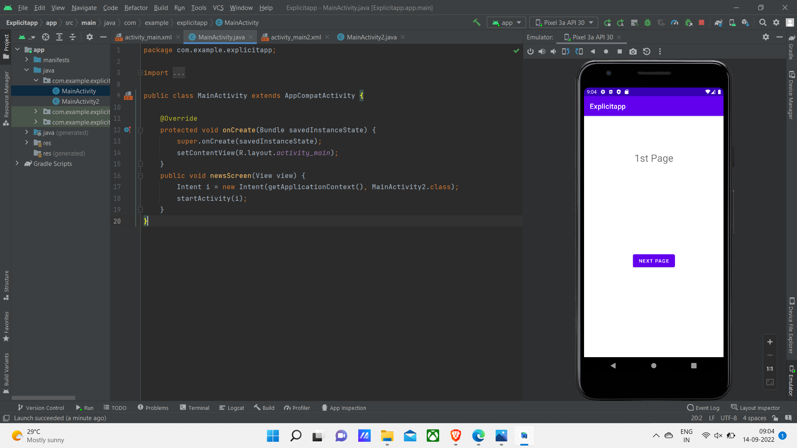
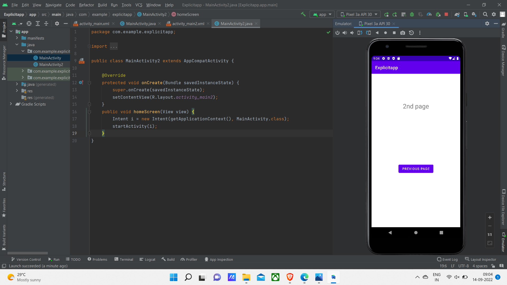

# Ex.No:2b Explicit Intents

Develop program to create two screens , first screen will take one number input from user. After click on Factorial button, second screen will open and it should display factorial of the same number using Explicit Intents.


## AIM:

To create a layout,click button and display factorial number using Explicit Intents in Android Studio.

## EQUIPMENTS REQUIRED:

Android Studio(Min. required Artic Fox)

## ALGORITHM:

Step 1: Open Android Stdio and then click on File -> New -> New project.

Step 2: Then type the Application name as ExplicitIntent and click Next. 

Step 3: Then select the Minimum SDK as shown below and click Next.

Step 4: Then select the Empty Activity and click Next. Finally click Finish.

Step 5: Design layout in activity_main.xml.

Step 6: Display factorial number using Explicit Intents in MainActivity file.

Step 7: Save and run the application.

## PROGRAM:
```
/*
Program to print the text “Explicit Intents”.
Developed by:MANOJ CHOUDHARY V
Registeration Number :212221240025
*/
```
## MainActivity.java
```
package com.example.explicitapp;

import androidx.appcompat.app.AppCompatActivity;

import android.content.Intent;
import android.os.Bundle;
import android.view.View;

public class MainActivity extends AppCompatActivity {

    @Override
    protected void onCreate(Bundle savedInstanceState) {
        super.onCreate(savedInstanceState);
        setContentView(R.layout.activity_main);
    }
    public void newsScreen(View view) {
        Intent i = new Intent(getApplicationContext(), MainActivity2.class);
        startActivity(i);
    }
}
```
## MainActivity2.java
```
package com.example.explicitapp;

import androidx.appcompat.app.AppCompatActivity;

import android.content.Intent;
import android.os.Bundle;
import android.view.View;

public class MainActivity2 extends AppCompatActivity {

    @Override
    protected void onCreate(Bundle savedInstanceState) {
        super.onCreate(savedInstanceState);
        setContentView(R.layout.activity_main2);
    }
    public void homeScreen(View view) {
        Intent i = new Intent(getApplicationContext(), MainActivity.class);
        startActivity(i);
    }
}
```
## activity_main.xml
```
<?xml version="1.0" encoding="utf-8"?>
<androidx.constraintlayout.widget.ConstraintLayout xmlns:android="http://schemas.android.com/apk/res/android"
    xmlns:app="http://schemas.android.com/apk/res-auto"
    xmlns:tools="http://schemas.android.com/tools"
    android:layout_width="match_parent"
    android:layout_height="match_parent"
    tools:context=".MainActivity">

    <TextView
        android:id="@+id/editText"
        android:layout_width="match_parent"
        android:layout_height="wrap_content"
        android:text="1st Page"
        android:textAlignment="center"
        android:textSize="28sp"
        app:layout_constraintBottom_toBottomOf="parent"
        app:layout_constraintEnd_toEndOf="parent"
        app:layout_constraintHorizontal_bias="0.0"
        app:layout_constraintStart_toStartOf="parent"
        app:layout_constraintTop_toTopOf="parent"
        app:layout_constraintVertical_bias="0.154" />

    <Button
        android:id="@+id/btn1"
        android:layout_width="wrap_content"
        android:layout_height="wrap_content"
        android:onClick="newsScreen"
        android:text="Next Page"
        app:layout_constraintBottom_toBottomOf="parent"
        app:layout_constraintEnd_toEndOf="parent"
        app:layout_constraintStart_toStartOf="parent"
        app:layout_constraintTop_toBottomOf="@+id/editText" />

</androidx.constraintlayout.widget.ConstraintLayout>
```
## activity_main2.xml
```
<?xml version="1.0" encoding="utf-8"?>
<androidx.constraintlayout.widget.ConstraintLayout xmlns:android="http://schemas.android.com/apk/res/android"
    xmlns:app="http://schemas.android.com/apk/res-auto"
    xmlns:tools="http://schemas.android.com/tools"
    android:layout_width="match_parent"
    android:layout_height="match_parent"
    tools:context=".MainActivity2">

    <TextView
        android:id="@+id/editText"
        android:layout_width="match_parent"
        android:layout_height="wrap_content"
        android:text="2nd page"
        android:textAlignment="center"
        android:textSize="28sp"
        app:layout_constraintBottom_toBottomOf="parent"
        app:layout_constraintEnd_toEndOf="parent"
        app:layout_constraintHorizontal_bias="0.0"
        app:layout_constraintStart_toStartOf="parent"
        app:layout_constraintTop_toTopOf="parent"
        app:layout_constraintVertical_bias="0.193" />

    <Button
        android:id="@+id/btn2"
        android:layout_width="wrap_content"
        android:layout_height="wrap_content"
        android:onClick="homeScreen"
        android:text="Previous page"
        app:layout_constraintBottom_toBottomOf="parent"
        app:layout_constraintEnd_toEndOf="parent"
        app:layout_constraintStart_toStartOf="parent"
        app:layout_constraintTop_toBottomOf="@+id/editText" />
</androidx.constraintlayout.widget.ConstraintLayout>
```

## OUTPUT




## RESULT
Thus a Simple Android Application to display factorial of the same number using Explicit Intents using Android Studio is developed and executed successfully.
