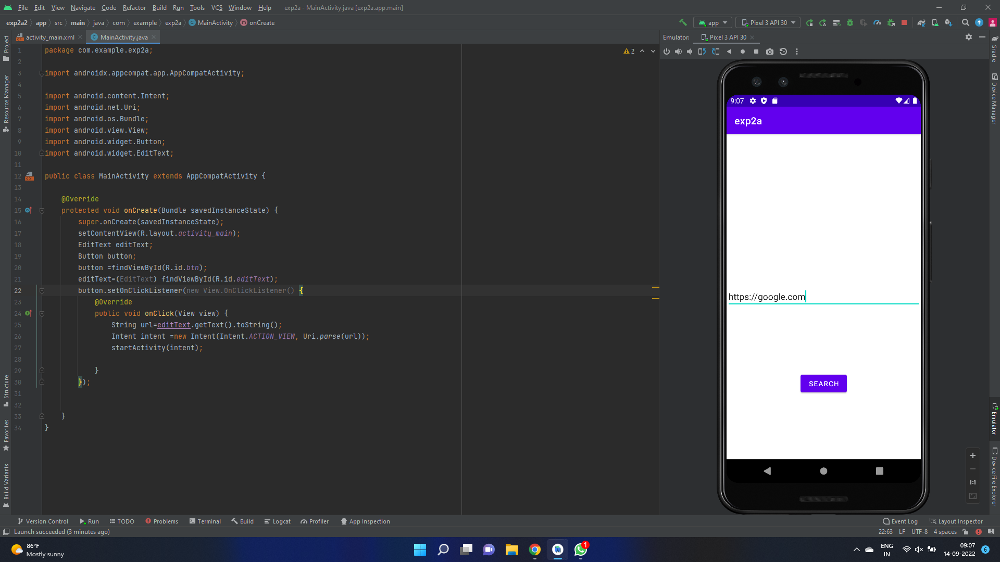
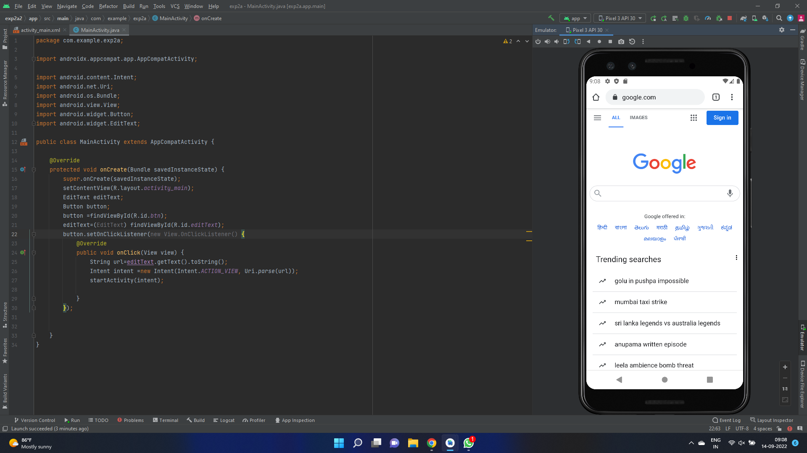
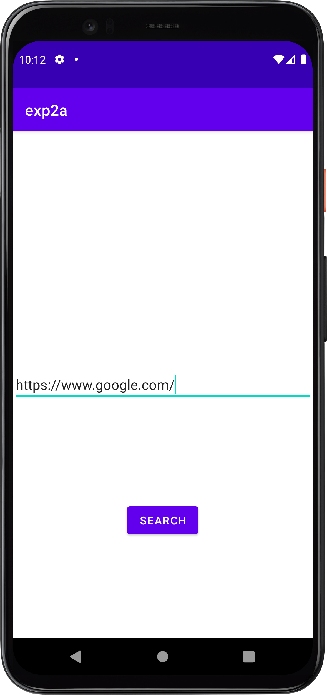
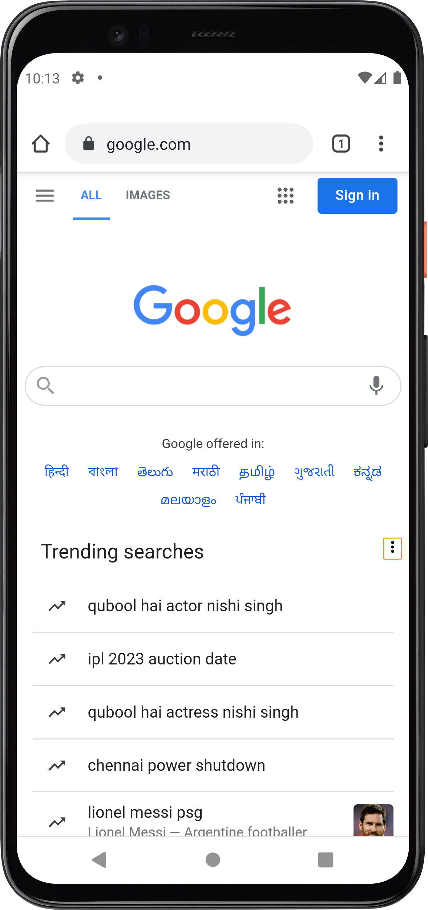

# Ex.No:2a Implicit Intent

Develop program to create a text field and a button “Navigate”. When you enter “www.google.com” and press navigate button it should open google page using Implicit Intents.


## AIM:

To create a layout,click button,open google page using Implicit Intents in Android Studio.

## EQUIPMENTS REQUIRED:

Android Studio(Min. required Artic Fox)

## ALGORITHM:

Step 1: Open Android Stdio and then click on File -> New -> New project.

Step 2: Then type the Application name as ImplicitIntent and click Next. 

Step 3: Then select the Minimum SDK as shown below and click Next.

Step 4: Then select the Empty Activity and click Next. Finally click Finish.

Step 5: Design layout in activity_main.xml.

Step 6: open google page using Implicit Intents in MainActivity file.

Step 7: Save and run the application.

## PROGRAM:
```
/*
Program to print the text “Implicit Intent”.
Developed by:MANOJ CHOUDHARY V
Registeration Number :212221240025
*/
```
## MainActivity.java
```
package com.example.exp2a;

import androidx.appcompat.app.AppCompatActivity;

import android.content.Intent;
import android.net.Uri;
import android.os.Bundle;
import android.view.View;
import android.widget.Button;
import android.widget.EditText;

public class MainActivity extends AppCompatActivity {

    @Override
    protected void onCreate(Bundle savedInstanceState) {
        super.onCreate(savedInstanceState);
        setContentView(R.layout.activity_main);
        EditText editText;
        Button button;
        button =findViewById(R.id.btn);
        editText=(EditText) findViewById(R.id.editText);
        button.setOnClickListener(new View.OnClickListener() {
            @Override
            public void onClick(View view) {
                String url=editText.getText().toString();
                Intent intent =new Intent(Intent.ACTION_VIEW, Uri.parse(url));
                startActivity(intent);

            }
        });


    }
}
```
## activity_main.xml
```
<?xml version="1.0" encoding="utf-8"?>
<androidx.constraintlayout.widget.ConstraintLayout xmlns:android="http://schemas.android.com/apk/res/android"
    xmlns:app="http://schemas.android.com/apk/res-auto"
    xmlns:tools="http://schemas.android.com/tools"
    android:layout_width="match_parent"
    android:layout_height="match_parent"
    tools:context=".MainActivity">

    <EditText
        android:id="@+id/editText"
        android:layout_width="match_parent"
        android:layout_height="wrap_content"
        app:layout_constraintBottom_toBottomOf="parent"
        app:layout_constraintEnd_toEndOf="parent"
        app:layout_constraintStart_toStartOf="parent"
        app:layout_constraintTop_toTopOf="parent" />
    <Button
        android:id="@+id/btn"
        android:text="Search"
        android:onClick="search"
        android:layout_width="wrap_content"
        android:layout_height="wrap_content"
        app:layout_constraintBottom_toBottomOf="parent"
        app:layout_constraintEnd_toEndOf="parent"
        app:layout_constraintStart_toStartOf="parent"
        app:layout_constraintTop_toBottomOf="@+id/editText" />
</androidx.constraintlayout.widget.ConstraintLayout>
```


## OUTPUT






## RESULT
Thus a Simple Android Application to open google page using Implicit Intents using Android Studio is developed and executed successfully.
