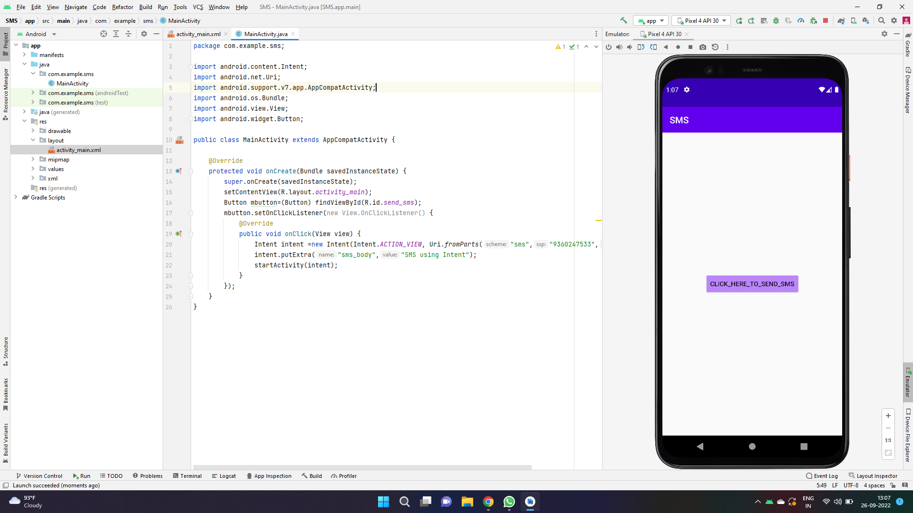
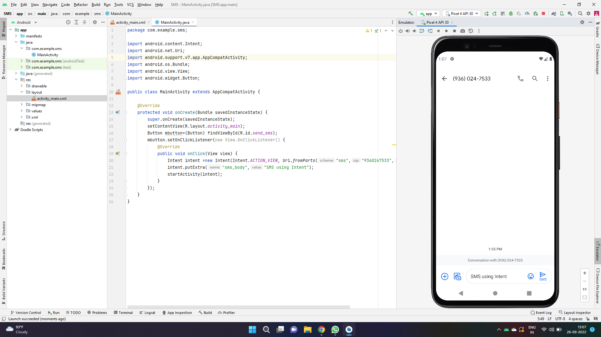

# Ex.No:4 Design an android application Send SMS using Intent.


## AIM:

To create and design an android application Send SMS using Intent using Android Studio.

## EQUIPMENTS REQUIRED:

Android Studio(Min. required Artic Fox)

## ALGORITHM:

Step 1: Open Android Stdio and then click on File -> New -> New project.

Step 2: Then type the Application name as “ex.no.4″ and click Next. 

Step 3: Then select the Minimum SDK as shown below and click Next.

Step 4: Then select the Empty Activity and click Next. Finally click Finish.

Step 5: Design layout in activity_main.xml.

Step 6: Send SMS and Display details give in MainActivity file.

Step 7: Save and run the application.

## PROGRAM:
```
/*
Program to create and design an android application Send SMS using Intent.
Developed by:MANOJ CHOUDHARY V
Registeration Number :212221240025
*/
```
## MainActivity.java
```
package com.example.sms;

import android.content.Intent;
import android.net.Uri;
import android.support.v7.app.AppCompatActivity;
import android.os.Bundle;
import android.view.View;
import android.widget.Button;

public class MainActivity extends AppCompatActivity {

    @Override
    protected void onCreate(Bundle savedInstanceState) {
        super.onCreate(savedInstanceState);
        setContentView(R.layout.activity_main);
        Button mbutton=(Button) findViewById(R.id.send_sms);
        mbutton.setOnClickListener(new View.OnClickListener() {
            @Override
            public void onClick(View view) {
                Intent intent =new Intent(Intent.ACTION_VIEW, Uri.fromParts("sms","9360247533",null));
                intent.putExtra("sms_body","SMS using Intent");
                startActivity(intent);
            }
        });
    }
}
```
## mainActivity.xml
```
<?xml version="1.0" encoding="utf-8"?>
<android.support.constraint.ConstraintLayout xmlns:android="http://schemas.android.com/apk/res/android"
    xmlns:app="http://schemas.android.com/apk/res-auto"
    xmlns:tools="http://schemas.android.com/tools"
    android:layout_width="match_parent"
    android:layout_height="match_parent"
    tools:context=".MainActivity">

    <Button
        android:id="@+id/send_sms"
        android:layout_width="wrap_content"
        android:layout_height="wrap_content"
        android:backgroundTint="@color/purple_200"
        android:text="click_here_to_send_sms"
        app:layout_constraintBottom_toBottomOf="parent"
        app:layout_constraintEnd_toEndOf="parent"
        app:layout_constraintStart_toStartOf="parent"
        app:layout_constraintTop_toTopOf="parent"
        app:layout_constraintVertical_bias="0.499" />

</android.support.constraint.ConstraintLayout>
```
## OUTPUT




## RESULT
Thus a Simple Android Application create and design an android application Send SMS using Intent using Android Studio is developed and executed successfully.
